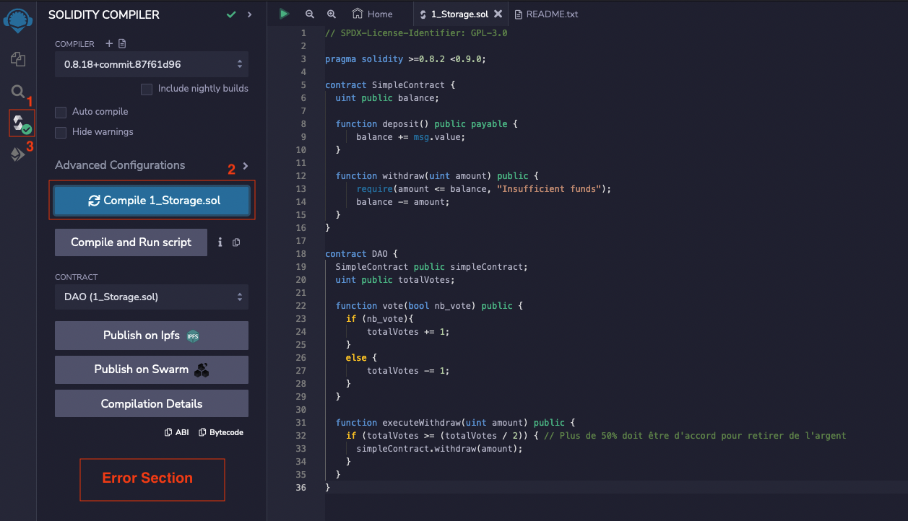
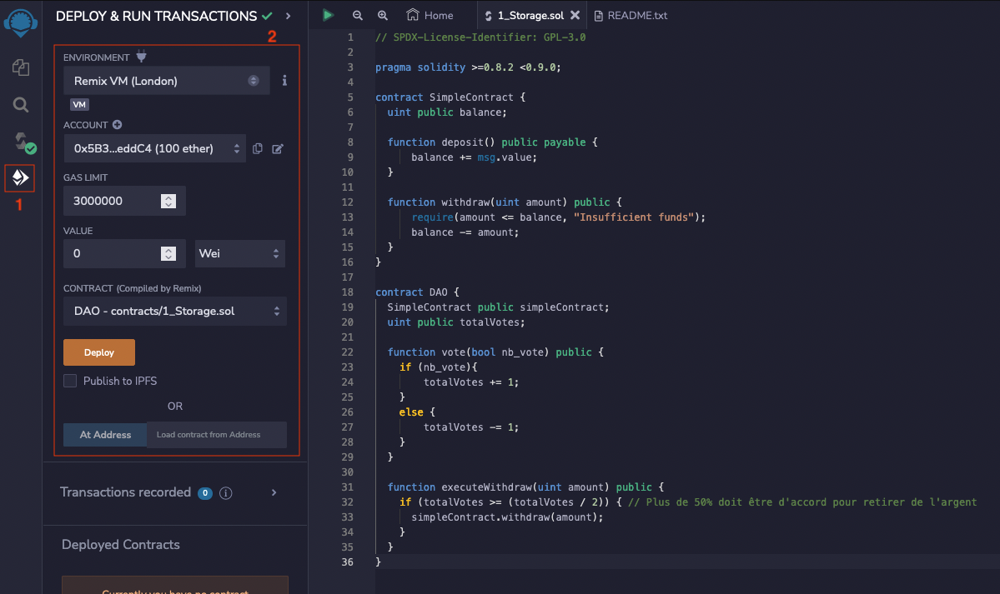

# Crétation d'une DAO

....

il est possible déployer des contrats facilement avec des outils en ligne comme _Remix_ :

1. Copiez le code Solidity de votre DAO dans un éditeur de code.

2. Allez sur la page Remix et copiez le code Solidity dans l'éditeur de code de Remix.

3. Cliquez sur le bouton "Compiler" __(1 et 2)__ pour compiler le code et vérifier qu'il n'y a pas d'erreur.

   

4. Cliquez sur le bouton "Déployer" __(1)__ pour déployer le contrat sur la blockchain Ethereum. Il faut configurer l'envirmonment de déploiement et les sous avec __(2)__

   

5. Votre wallete ETH (ex Metamask) vous demandera de confirmer la transaction de déploiement en vous affichant une fenêtre contextuelle.

6. Après avoir confirmé la transaction, vous pouvez vérifier que le contrat a été déployé avec succès en consultant la blockchain Ethereum ou en utilisant un explorateur de blocs.


Mais il existe également des outils plus complexe comme _Hardhat_, qui permet d'avoir un degré de liberté plus important sur la création d'un contrat comme la mise en oeuvre de test ou encore un déploiement de la dao sur une blockchain local avec un wallete et des ETH fictif.


## Hardhat

#### Création de l'envrionement de dev 

__Installation de `npm`__:

1. MacOS:

   ```bash
   $ brew install npm
   ```

2. Linux:

   ```bash
   $ sudo apt install npm
   ```

   

__Création du projet__:

```bash
$ mkdir dao 
$ cd dao
$ npm install -d hardhat
```

```bash
$ npx hardhat
You are using a version of Node.js that is not supported by Hardhat, and it may work incorrectly, or not work at all.

Please, make sure you are using a supported version of Node.js.

To learn more about which versions of Node.js are supported go to https://hardhat.org/nodejs-versions
888    888                      888 888               888
888    888                      888 888               888
888    888                      888 888               888
8888888888  8888b.  888d888 .d88888 88888b.   8888b.  888888
888    888     "88b 888P"  d88" 888 888 "88b     "88b 888
888    888 .d888888 888    888  888 888  888 .d888888 888
888    888 888  888 888    Y88b 888 888  888 888  888 Y88b.
888    888 "Y888888 888     "Y88888 888  888 "Y888888  "Y888

👷 Welcome to Hardhat v2.12.7 

? What do you want to do? …
  Create a JavaScript project
  Create a TypeScript project
❯ Create an empty hardhat.config.js
  Quit
```

```bash
$ npm install --save-dev @nomiclabs/hardhat-ethers ethers @nomiclabs/hardhat-waffle ethereum-waffle chai
```

```bash
$ mkdir contracts
$ touch my_contracts.sol
```

```bash
dao
├── contracts
│   └── my_contract.sol
├── hardhat.config.js
├── node_modules
│   └── ...
├── package-lock.json
└── package.json
```


#### Réalisation du code _solidity_

```solidity
// SPDX-License-Identifier: GPL-3.0
pragma solidity ^0.8.0;

contract SimpleContract {
  uint public balance;

  function deposit() public payable {
      balance += msg.value;
  }

  function withdraw(uint amount) public {
      require(amount <= balance, "Insufficient funds");
      balance -= amount;
  }
}

contract DAO {
  SimpleContract public simpleContract;
  uint public totalVotes;

  function vote(bool nb_vote) public {
    if (nb_vote){
        totalVotes += 1;
    }
    else {
        totalVotes -= 1;
    }
  }

  function executeWithdraw(uint amount) public {
    if (totalVotes >= (totalVotes / 2)) { // Plus de 50% doit être d'accord pour retirer de l'argent
      simpleContract.withdraw(amount);
    }
  }
}
```


#### Configuration de _Hardhat_


#### Compilation 

```bash
$ npx hardhat compile 
```


#### Test 


#### Déploiment